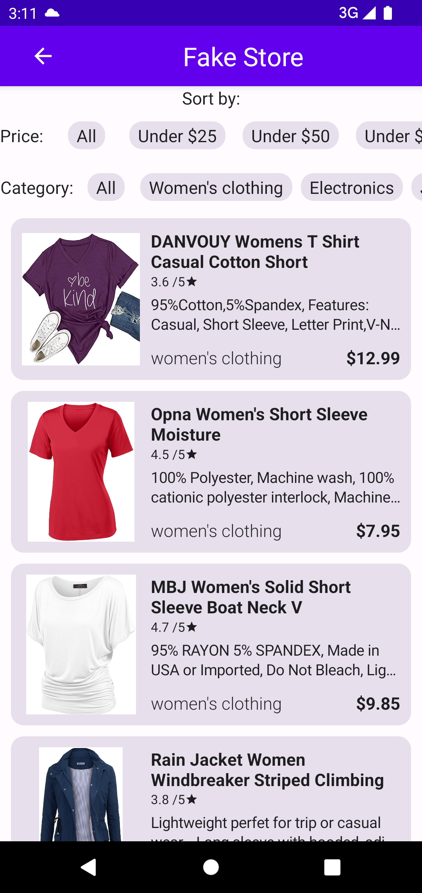
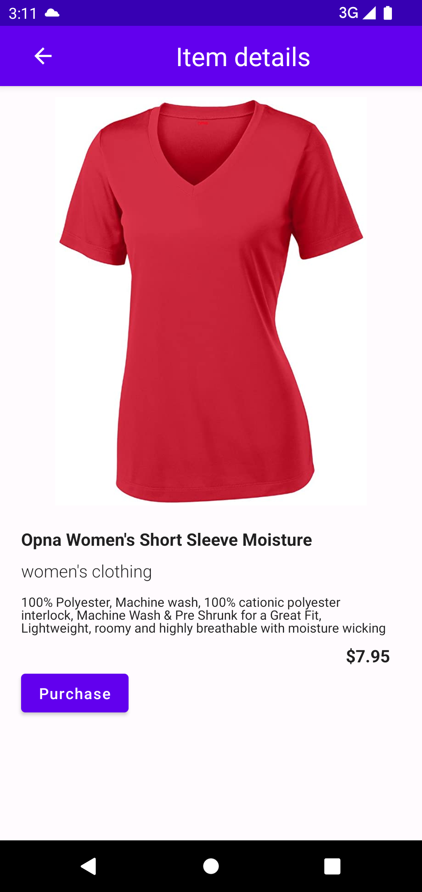

# ShopCompose
 FakeStore (xml) migrated to Jetpack Compose
 Project created in MVVM architecture in Compose, following the clean architecture for LBG.

 Created using Dependency Injection (Dagger/Hilt), Coroutines, Glide (Images), and filtering using Compose functionalities.

 Tested using JUnit and mockk for mocking repository and coroutine response.

 
 
 
