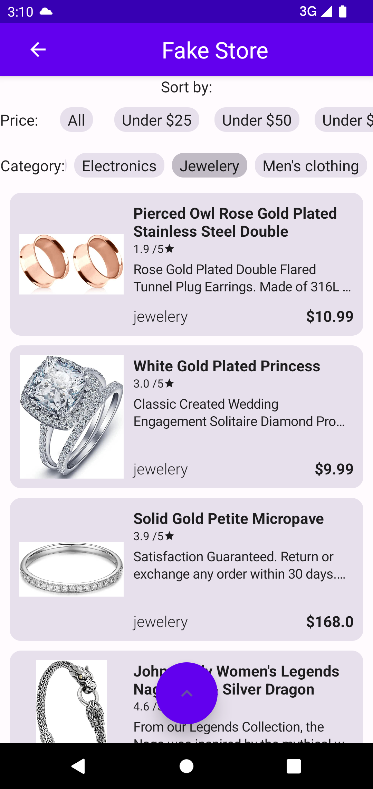

# ShopCompose
 FakeStore (xml) migrated to Jetpack Compose
 Implementing same functionality as xml version without having to use room database for sorting, thanks to logic being implemented in the views
 
 
 
 
